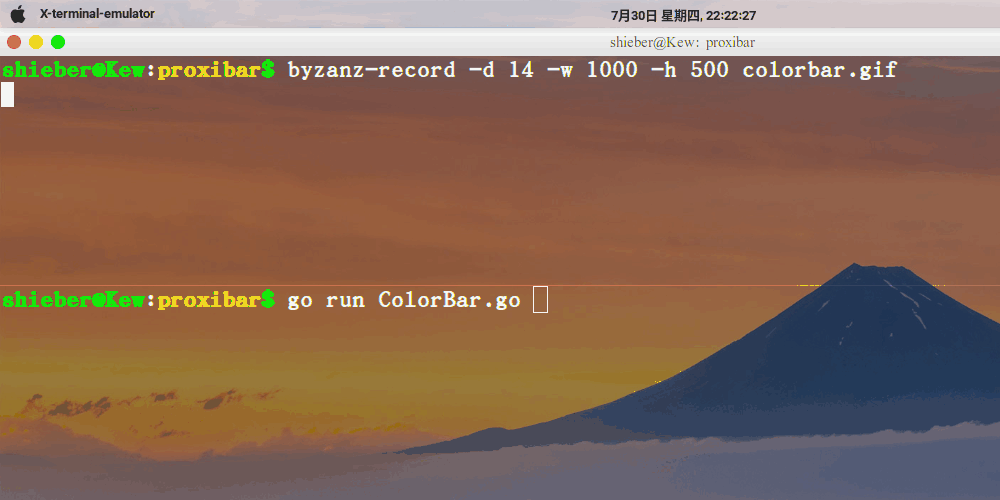

# Color Bar
:experimental:
:author: 'Shieber'
:date: '2020.07.30'

### Description
[link:README_CN.adoc[中文]] Print the processing bar of a job with color.

### Usage
$: `go run ColorBar.go`

### Demo

